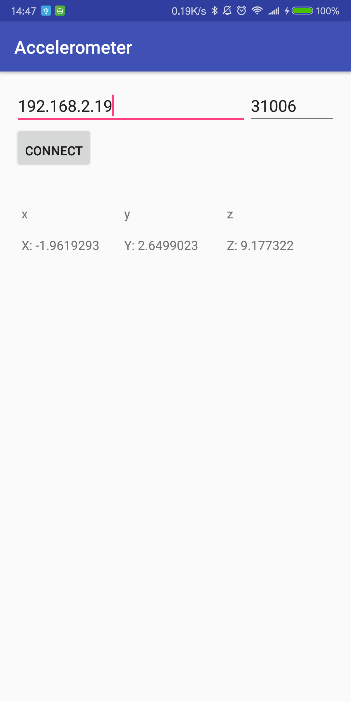

# Android-Send-Accelerometer-Data-Using-TCP
Send accelerometer data using TCP sockets from an Android cellphone.


## Demo



Received data using a TCP server:

```
Connection address: ('192.168.2.2', 59786)
received data: -0.0848846435547   -0.0890655517578   9.82136535645
received data: -0.0753021240234   -0.0938415527344   9.81896972656
received data: -0.0920562744141   -0.101028442383   9.81657409668
received data: -0.0848846435547   -0.0986328125   9.81896972656
received data: -0.0776977539062   -0.105819702148   9.82376098633
received data: -0.0705108642578   -0.0986328125   9.83573913574
received data: -0.0800933837891   -0.0986328125   9.82376098633
received data: -0.0848846435547   -0.101028442383   9.82136535645
received data: -0.0705108642578   -0.0890655517578   9.81896972656
received data: -0.0800933837891   -0.086669921875   9.81896972656
```
